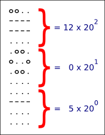

# What will I learn?
	StringsRadix

Solving this puzzle validates that you can manage string manipulation 
(split, concatenation, conversion), array arithmetics.  
You may discover the vigesimal (base twenty numeral) system.

*External resources* `Loops, Strings`

# Statement
The goal of this puzzle is to make you compute an arithmetic operation from two mayan number.  
This puzzle make you discover computation in base 20 (used by mayans).  
It will make you play a lot with string to digits conversions and mechanics to store their values in associative arrays.

# Story
We all know now that the world did not end on December 21st 2012.  
But it's true that it is easy to misread mayan calculations, because their numeral system is so complicated!

Help us find the date of the next apocalypse, decyphering messages from an other time.

# Goal

Upon discovering a new Maya site, hundreds of mathematics, physics and astronomy books have been uncovered.  
The end of the world might arrive sooner than we thought, but we need you to be sure that it doesn't!  
Thus, in order to computerize the mayan scientific calculations, you're asked to develop a program capable of  
performing basic arithmetical operations between two mayan numbers.

# Rules
The mayan numerical system contains `20` numerals going from `0` to `19`.  
Here's an ASCII example of their representation:  
`  0       1       2     3       4      5      6     7      8      9`  
`.oo.    o...    oo..   ooo.   oooo   ....   o...   oo..   ooo.   oooo`  
`o..o    ....    ....   ....   ....   ----   ----   ----   ----   ----`  
`.oo.    ....    ....   ....   ....   ....   ....   ....   ....   ....`  
`....    ....    ....   ....   ....   ....   ....   ....   ....   ....`  

` 10     11     12     13     14     15     16     17     18     19`  
`....   o...   oo..   ooo.   oooo   ....   o...   oo..   ooo.   oooo`  
`----   ----   ----   ----   ----   ----   ----   ----   ----   ----`  
`----   ----   ----   ----   ----   ----   ----   ----   ----   ----`  
`....   ....   ....   ....   ....   ----   ----   ----   ----   ----`  

A mayan number is divided into vertical sections. Each section contains a numeral (from 0 to 19)  
representing a power of 20. The lowest section corresponds to 200, the one above to 201 and so on.

Thereby, the example below is : (12 x 20 x 20) + (0 x 20) + 5 = 4805

To spice the problem up, the mayans used several dialects, and the graphical representation of the numerals could vary from one dialect to another.
 
The representation of the mayan numerals will be given as the input of your program in the form of ASCII characters.  
You will have to display the result of the operation between the two given mayan numbers. The possible operations are *, /, +, - 