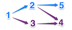

# What will I learn?

	Graphs, Memoization, Recursion

This puzzle uses the oriented graph data structure.  
You can solve it using recursive function to go through nodes of a tree using a Depth First Search Algorithm.  
External resources TreeTree traversalDepth First SearchDirected graphRecursion  

# Statement

The goal of the puzzle is to make you compute the height of a tree data structure.  
It will make you discover how to build a tree and use recursive algorithm to compute the longest chain of nodes.  
The graph theory behind the algorithm of this puzzle is one of the most important aspects of programming  
and is at the base for a lot of tools and application today (like google, facebook, twitter, …).

# Story

It is sometimes interesting to find what authors has influenced our favorite writer.  
What if we tried to find out who herited from whom, with the help of an influence graph?

# The Goal
The saying "Dwarfs standing on the shoulders of giants" refers to the importance of being able to build upon the work of our predecessors.
 
When we read texts, we often only get a small glance of this dependence: this person influenced that person.  
Thereafter, we learn that the second person, in turn influenced a third and so on.  
In this exercise we’re interested in the chain of influence and more precisely in finding the longest possible chain.​

# Rules

We choose to represent each person by a distinct integer.  
If person `#1` has influenced persons `#2` and `#3` and person `#3` has influenced `#4` then there is a succession of  
thoughts between `#1`, `#3` and `#4`.  
In this case, it’s the longest succession and the expected result will be `3`, since it involves 3 people.

 
If we were to complete this example when we learn that person #2 also influenced persons `#4` and `#5`,  
then the longest succession will still have a length of `3`, but there will now be several of them.

 
If we now add that person `#10` influenced person #11, the result remains `3`.  
However, as soon as we learn that `#10` also influenced `#1` and `#3`, then the result becomes `4`,  
since there is now a succession involving 4 people, which is `#10`, `#1`, `#2`, `#5`.

 
Note: It takes time for a thought to influence others.  
So, we will suppose that it is not possible to have a mutual influence between people, i.e.  
If A influences B (even indirectly through other people), then B will not influence A  
(even indirectly). Also, you can not influence yourself.

