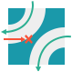
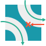

# What will I learn?

> Conditions

This puzzle makes you use an associative array that make a link between arbitrary types and directions. You also need to store some values in a 2D array.  

> External resources:  

Associative arrayHash TableMultidimensional arrayTwo dimensional array

# Statement

The goal of this puzzle is to predict the path that a character will take in a labyrinth according to the topology of the rooms.  
The resolution of this exercise intensively focus on the correct usage of associative arrays.  
If you can manage them correctly and creates the right associations, your final code could be quite short.  
  
# Story
Indiana is trapped in a tunnel, help him escape!  
In this first level, you just have to get familiar with how the tunnel works: your goal is simply to predict Indiana movements within this tunnel.

# The Goal
Your objective is to write a program capable of predicting the route Indy will take on his way down a tunnel.  
Indy is not in danger of getting trapped in this first mission.

# Rules
The tunnel consists of a patchwork of square rooms of different types.  
The rooms can be accessed and activated by computer using an ancient RS232 serial port (because Mayans aren't very technologically advanced, as is to be expected...).  

There is a total of 14 room types (6 base shapes extended to 14 through rotations).

Upon entering a room, depending on the type of the room and Indy's entrance point (TOP,LEFT, or RIGHT) he will either exit the room through a specific exit point, suffer a lethal collision or lose momentum and get stuck:

 ## ROOM TYPES:
 * TYPE - 0  
  

 * TYPE - 1   
  
 
 * TYPE - 2   
  
 
 * TYPE - 3   
   
 
 * TYPE - 4   
  
 
 * TYPE - 5   
  
 
 * TYPE - 6   
  
 
 * TYPE - 7   
 
 
 * TYPE - 8   
  
 
 * TYPE - 9   
  
 
 * TYPE - 10   
  
 
 * TYPE - 11   
  
 
 * TYPE - 12   
  
 
 * TYPE - 13   
  
 