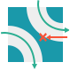
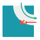

# What will I learn?

> Backtracking, Pathfinding

In this puzzle, you have to use an associative array that maps arbitrary types to directions.

You compute the list of all possible actions from a complex environment (lots of different variables).

You go through the nodes of a tree using a depth first search algorithm.

You handle complex data structure, like trees, to store the list of possibilities over the time.

You have to optimize your algorithm to reduce the number of combinations in order to decrease the overall computation time. You have to prune a decision tree based on heuristics.

You can perform advanced backtracking operations.

> TO HELP YOU GET STARTED

Focus on a Puzzle: The Last Crusade by fafl

> External resources
 
Associative arrayTreeTree traversalDepth First SearchBacktracking

# Statement

The goal of the puzzle is to select rooms to pivot from a 2 dimensional grid to help Indiana Jones find his way to the exit.  
This puzzle requires to build the tree of all the possible rotations that can be performed over time, and use some heuristics   
to perform some predictive optimisations to avoid unnecessary computation.

# Story

Indiana Jones nevers listens. We told him that forbidden temples are dangerous, but there he is, dashing through a moving labyrinth and risking his life.

Dodge the traps, and help him find his way out of this highway to hell. Beware of the rolling stone!

# Rules

The structure of the tunnel hasn't changed. To review the types of rooms, click here.
However, at the beginning there is no longer an unbroken safe route from start to finish.

Fortunately, certain rooms can now be rotated each turn by a quarter turn clockwise or counterclockwise.  
Some rooms are locked in place and cannot be rotated (these rooms have a negative type in the provided grid).  
Furthermore, you cannot rotate the rooms containing Indy or leading to the exit.

This turn around, your mission consists of writing a program capable of rotating tunnel rooms in order to lead Indy to safety.

For example:  

Spin the room (0,1) towards the right to establish a safe route to the exit.

Lastly, for the last two tests only, giant rocks can appear within the tunnel system. If Indy comes into contact with a rock, he dies.  

The rocks have the following behavior:
* They can arrive on any game turn.
* They only arrive from an edge of the grid.
* They follow the same rules of movement as Indy (and dissapear if they leave the grid).
* If a rock hits a wall or gets stuck, it will be destroyed and dissapear from the grid on the next turn.
* You cannot rotate a room containing a rock.
* You do not need to anticipate the arrival of rocks in your algorithm: whatever choices you made before a rock appears,   
if you had a chance to win before the arrival, you will still have a chance after the arrival of the rock.

On each game turn:
* You are given Indy's current position.
* Then you can spin a room clockwise or counterclockwise with the commands LEFT and RIGHT, or do nothing with the command WAIT.
* Indy will then advance to the next room according to the shape of the current room.

## Previous Game level

[Game level 2](https://www.codingame.com/ide/puzzle/the-last-crusade-episode-1 "title") 

## ROOM TYPES:
 
### TYPE - 0
* 0  

* 90  

* 180  
 

* 270  

### TYPE - 1
* 0  

* 90  

* 180  

* 270  

### TYPE - 2
* 0  

* 90  

* 180  

* 270  

 
### TYPE - 3
* 0  

* 90  

* 180  

* 270  

 
### TYPE - 4
* 0  

* 90  

* 180  

* 270  

### TYPE - 5
* 0  

* 90  

* 180  

* 270  

### TYPE - 6
* 0  

* 90  

* 180  

* 270  

### TYPE - 7
* 0  

* 90  

* 180  

* 270  

### TYPE - 8
* 0  

* 90  

* 180  

* 270  

### TYPE - 9
* 0  

* 90  

* 180  

* 270  

### TYPE - 10
* 0  

* 90  

* 180  

* 270  

### TYPE - 11
* 0  

* 90  

* 180  

* 270  

### TYPE - 12
* 0  

* 90  

* 180  

* 270  

### TYPE - 13
* 0  

* 90  

* 180  

* 270  

# Existing mapping

const dirs = {
 '1T': {y: 1, dir: 'T'},
 '1L': {y: 1, dir: 'T'},
 '1R': {y: 1, dir: 'T'},
 '2L': {x: 1, dir: 'L'},
 '2R': {x: -1, dir: 'R'},
 '3T': {y: 1, dir: 'T'},
 '4T': {x: -1, dir: 'R'},
 '4R': {y: 1, dir: 'T'},
 '5T': {x: 1, dir: 'L'},
 '5L': {y: 1, dir: 'T'},
 '6L': {x: 1, dir: 'L'},
 '6R': {x: -1, dir: 'R'},
 '7T': {y: 1, dir: 'T'},
 '7R': {y: 1, dir: 'T'},
 '8L': {y: 1, dir: 'T'},
 '8R': {y: 1, dir: 'T'},
 '9T': {y: 1, dir: 'T'},
 '9L': {y: 1, dir: 'T'},
 '10T': {x: -1, dir: 'R'},
 '11T': {x: 1, dir: 'L'},
 '12R': {y: 1, dir: 'T'},
 '13L': {y: 1, dir: 'T'}
};

const turns = {
 '2L': 3,
 '2R': 3,
 '3L': 2,
 '3R': 2,
 '4L': 5,
 '4R': 5,
 '5L': 4,
 '5R': 4,
 '6L': 9,
 '6R': 7,
 '7L': 6,
 '7R': 8,
 '8L': 7,
 '8R': 9,
 '9L': 8,
 '9R': 6,
 '10L': 13,
 '10R': 11,
 '11L': 10,
 '11R': 12,
 '12L': 11,
 '12R': 13,
 '13L': 12,
 '13R': 10
};

