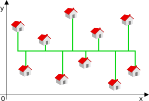

# What will I learn?

LoopsDistancesMedians

This puzzle makes you grasp the basics of optimizing a value, and handle mathematical concepts (average, median, distances, ...).

* External resources MedianManhattan distance

# Statement

Given a list of houses and their position on a grid, find an optimal layout of cabling in order to connect all houses while using the minimum length of cable possible.
Solve it

# Story

Today you're in charge of linking a series of individual houses to the general network.  
Problem is, before leaving the facility, your scatterbrain of a collegue has forgotten a major part of the cable coils.  
*Sigh*, guess you'll have to manage to use the shortest possible length of cable.

# The Goal
An internet operator plans to connect a business park to the optical fiber network.  
The area to be covered is large and the operator is asking you to write a program  
that will calculate the minimum length of optical fiber cable required to connect all buildings.

# Rules
For the implementation of the works, the operator has technical constraints  
whereby it is forced to proceed in the following manner:
A main cable will cross through the park from the West to the East  
(from the position x of the most westerly building to the position x of the most easterly building).

For each building, a dedicated cable will connect from the building to the main cable by a minimal path (North or South), as shown in the following example:

 

The minimum length will therefore depend on the position of the main cable.